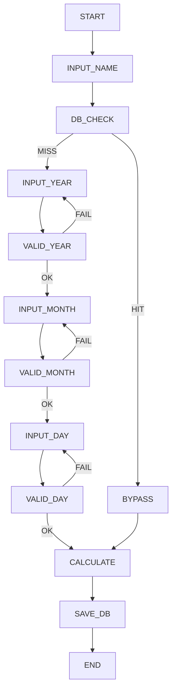

# SYNAPSE Axon IR Spec (Rust) v0.4-Heavy

## 1. Overview

This document defines an Axon-compatible IR specification for validating logic flow,
state transitions, constraints, and failure handling in the SYNAPSE Age Calculator system.

---

## 2. Node Definitions

| Node | Type | Description |
|------|------|------------|
| START | control | Entry point |
| INPUT_NAME | input | User name input |
| DB_CHECK | process | Query DB |
| BYPASS | control | Skip input flow |
| INPUT_YEAR | input | Year input |
| VALID_YEAR | validation | Year validation |
| INPUT_MONTH | input | Month input |
| VALID_MONTH | validation | Month validation |
| INPUT_DAY | input | Day input |
| VALID_DAY | validation | Day validation |
| CALCULATE | compute | Age calculation |
| SAVE_DB | persistence | Store/update DB |
| END | control | Exit |

---

## 3. State Transitions

---

## 4. Constraints

- VALID_YEAR must precede VALID_MONTH
- VALID_MONTH must precede VALID_DAY
- CALCULATE requires validated inputs OR bypass data
- BYPASS skips INPUT_YEAR, INPUT_MONTH, INPUT_DAY
- SAVE_DB must occur after CALCULATE

---

## 5. Loop Definitions

- VALID_YEAR → INPUT_YEAR (retry loop)
- VALID_MONTH → INPUT_MONTH (retry loop)
- VALID_DAY → INPUT_DAY (retry loop)

---

## 6. Failure Cases

- Year > current_year → reject
- Year < current_year - 120 → warning loop
- Invalid date → retry
- DB failure → fallback mode

---

## 7. External Dependencies

| Node | External |
|------|---------|
| CALCULATE | chrono |
| DB_CHECK / SAVE_DB | rusqlite |
| OUTPUT | ratatui |

---

## 8. IR Semantics

- All validation nodes must produce Result<T, E>
- All input nodes must be retry-capable
- Control nodes must not mutate state
- Persistence must be idempotent

---

## 9. Verification Targets

- Loop detection correctness
- Bypass edge integrity
- Constraint satisfaction
- Failure propagation handling
- External dependency isolation

---

## 10. Expected Axon Behavior

- Graph must contain at least 1 bypass edge
- Graph must contain ≥3 validation loops
- No direct path from INPUT_NAME → CALCULATE without DB_CHECK
- CALCULATE must not execute with invalid inputs
