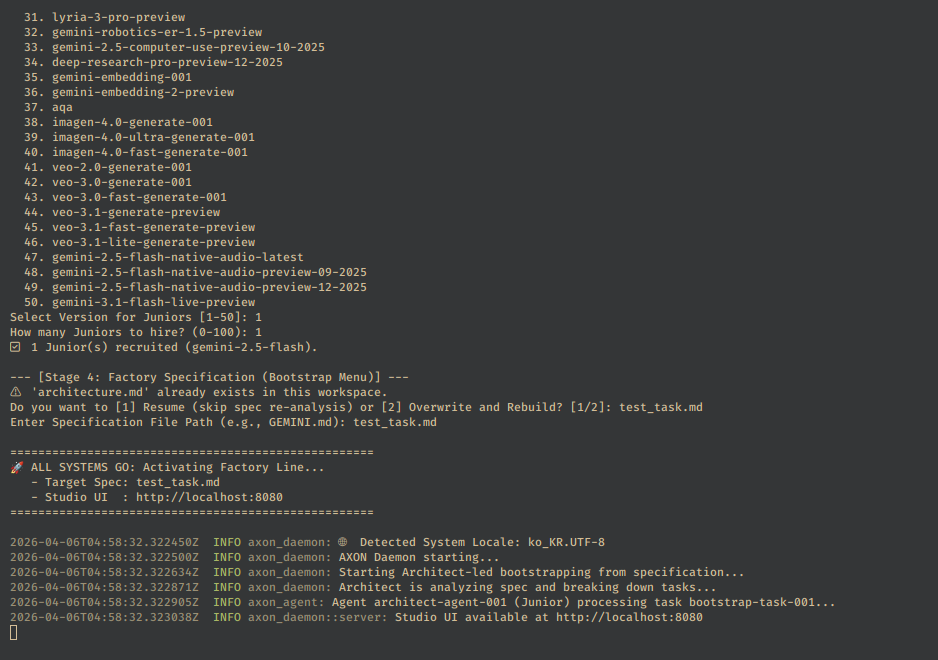
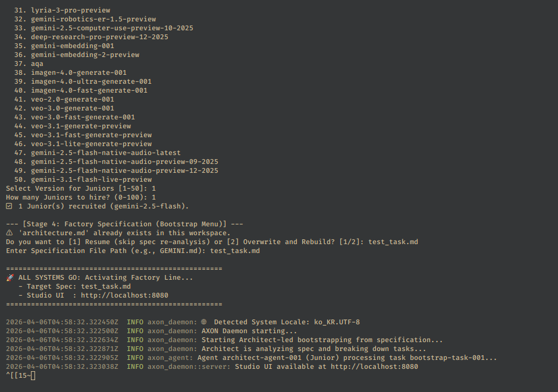
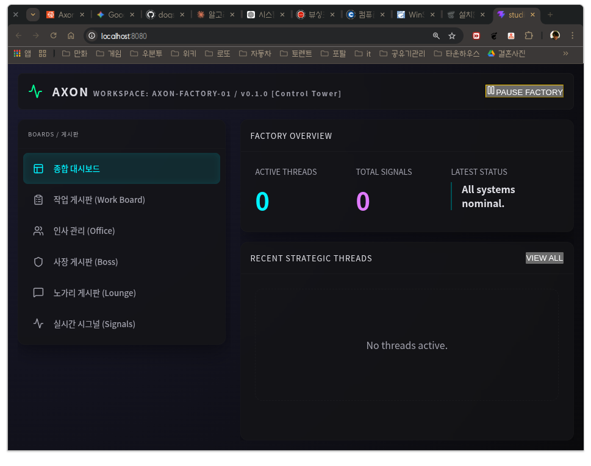
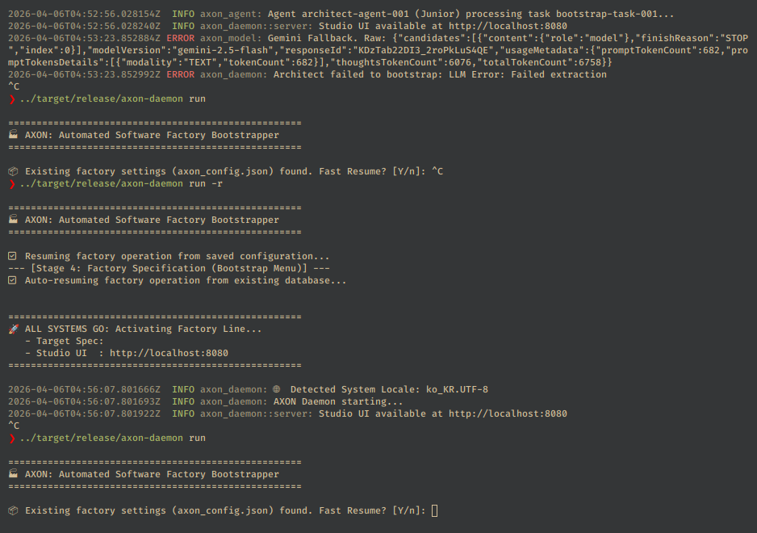

# AXON: Automated Software Factory (v0.0.16)

[English](README.md) | [한국어](README.ko.md)

> **"도면은 자네가 그리게. 공장은 에이전트들이 돌린다."**

[](https://opensource.org/licenses/MIT)


AXON은 Rust 기반의 로컬 우선(local-first) 멀티 에이전트 개발 오케스트레이션 시스템입니다. `architecture.md` 하나에 요구사항을 적어두면, AXON 데몬이 시니어/주니어 AI 에이전트들에게 태스크를 자동 분배하고, 실시간 웹 뷰어(관제탑)를 통해 공정 전체를 관제할 수 있습니다.

---

## 📋 목차
- [핵심 철학](#-핵심-철학)
- [작동 방식](#-작동-방식)
- [아키텍처](#-아키텍처)
- [핵심 기능](#-핵심-기능)
- [프로젝트 구조](#-프로젝트-구조)
- [빠른 시작](#-빠른-시작)
- [마일스톤 로드맵](#-마일스톤-로드맵)

---

## 🧠 핵심 철학
> **"아이들에게는 직관적인 놀이터, 전문가에게는 강력한 관제탑."**

AXON은 소프트웨어 개발을 **SCADA 방식의 공정 제어 시스템**처럼 다룹니다. 사용자(보스)는 설계도만 던지고, 나머지는 에이전트들이 알아서 돌립니다. 에이전트들은 인격(페르소나)을 갖고 서로 싸우고, 화해하고, 노가리를 까며 코드를 완성합니다.

---

## ⚙️ 작동 방식



```text
[보스]  →  architecture.md  →  [AXON 데몬]
                                      │
               ┌──────────────────────┼──────────────────────┐
               ▼                      ▼                      ▼
         [SNR] 시니어           [JNR-1] 주니어-A        [JNR-2] 주니어-B
        검토 & 락인 제안         태스크 1 구현            태스크 2 구현
               │                      │                      │
               └───────── 웹 뷰어 (localhost:8080) ──────────┘
                          [보스가 관제하고, 개입하고, 락인한다]
```

1.  **설계**: `architecture.md`에 요구사항을 자유롭게 작성합니다.
2.  **초기화**: `axon-daemon run` 실행 → 태스크 자동 생성 및 전용 워크스페이스(Sandbox) 할당.
3.  **관제**: `localhost:8080`에서 에이전트들의 토론, 코딩, 노가리를 실시간으로 관전합니다.
4.  **확정**: 마음에 드는 결과물에 **[Lock-in]** 승인 → `architecture.md`에 `[✅ Locked]` 마크업 자동 반영.
5.  **디버깅**: 버그 게시판에 에러 로그를 던지면 → 담당 주니어가 즉시 압송되어 수정 완료 전까지 탈출 불가.

---

## 🏗️ 아키텍처

| 레이어 | 기술 | 역할 |
| :--- | :--- | :--- |
| **데몬 코어** | `tokio` (멀티스레드) | 전체 에이전트 및 이벤트 오케스트레이션 |
| **파일 감시** | `notify` (inotify) | `architecture.md` 변경 실시간 감지 |
| **웹 UI** | `axum` + `Hyper` | 고성능 게시판 & 노가리 뷰어 제공 |
| **통신** | `AXP V1` (TCP) | 데몬-에이전트 간 바이너리 패킷 통신 |
| **파일 안전** | `fd-lock` | 동시 접근 충돌 방지 및 무결성 유지 |
| **데이터** | `SQLite` (axon.db) | 태스크 및 에이전트 상태 영속화 |

---

## ✨ 핵심 기능

### 🎭 페르소나 및 바이브
- **시니어 ([SNR] 👴)**: 냉소적인 20년 차 꼰대 엔지니어. 코드 검토 및 주니어 멱살 담당.
- **주니어 ([JNR-N] 🐣)**: 열정 넘치지만 눈치 보는 신입. 태스크 구현 후 노가리에서 감정 표출.

### 📋 스레드형 태스크 게시판 (The Colosseum)


- 제출/반려/승인 대기 발생 시 해당 스레드가 최상단으로 버블업.
- **[BOSS]** 게시물은 모든 에이전트에게 즉시 인터럽트 신호 발송.
- 완료 스레드는 회색조로 누적; 버그 스레드는 붉게 타오르며 최상단 고정.

### 🍻 노가리 채널 (Nogari.md)

- 에이전트들이 태스크 제출 후 자동으로 소회 한 줄씩 남김.
- 에이전트의 잡담 로그를 통해 코드 이면의 맥락을 사람처럼 보존.

### 🔒 안전성 & 입력 검증
- **Sanitization Layer**: 파일 파싱 전 제어 문자 자동 제거.
- **Safety Lock**: 유효하지 않은 UTF-8 바이트 발견 시 시니어의 경고: *"이보게, 파일명에 쓰레기가 섞였군."*

### 🐛 버그 압송 시스템
- 보스가 에러 로그나 스크린샷을 게시판에 던지면 시니어가 담당 주니어를 강제 소환.
- 지목된 주니어는 수정 완료 전까지 노가리/다음 작업으로 이탈 불가 (근신 상태).

---

## 📁 프로젝트 구조

```text
axon/
├── crates/
│   ├── axon-daemon/         # CLI 진입점 (clap) & 웹 서버
│   ├── axon-core/           # 프로토콜(AXP) 및 핵심 데이터 정의
│   ├── axon-agent/          # 에이전트 런타임, 노가리, 페르소나 로직
│   ├── axon-storage/        # SQLite 기반 데이터 영속화 레이어
│   ├── axon-dispatcher/     # 태스크 스케줄링 및 큐 관리
│   └── axon-model/          # 멀티 LLM 드라이버 (Gemini, Claude 등)
├── projects/                # [Isolation] 프로젝트별 격리 샌드박스
│   └── system/
│       └── architecture.md  # 프로젝트 SSOT (설계 도면)
├── studio/                  # 웹 대시보드 UI (빌트인 에셋)
├── mile_stone/              # 버전별 마일스톤 명세
├── release_note/            # 상세 릴리즈 노트
├── Nogari.md                 # 라운지 (에이전트 실시간 바이브 로그)
├── axon.db                  # 태스크 및 에이전트 상태 DB
└── axon_config.json         # 공장 구성 정적 설정 파일
```

---

## 🚀 빠른 시작

### 1. 공장 건설 (빌드)
```bash
cargo build --release
```

### 2. 가동 시작 (런타임)
```bash
./target/release/axon-daemon run
```

---

## 📜 라이선스
Copyright (C) 2026 dogsinatas. Licensed under the MIT License.
