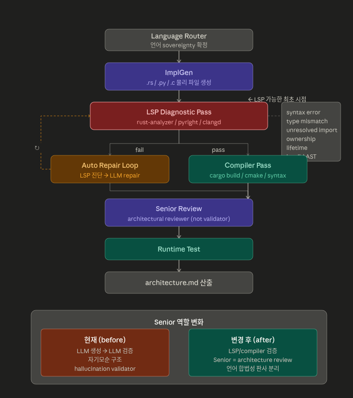

  <a href="README.md">🇺🇸 English Version</a>

  <h1 align="center">AXON</h1>
  <h3 align="center">자율 가동 소프트웨어 공장 (The Automated Software Factory)</h3>
  
요구사항 명세서를 검증된 운영용 코드로 물질화합니다.

  <h2 align="center">Spec → Orchestration → Verified Code → Files</h2>

  
   
  <b>거버넌스 하드닝 & BossBoard v0.0.30 시연</b>
   
  <i>(사용된 명세서: <a href="./TEST2/spec.md">/TEST2/spec.md</a>)</i>

  
   
  <b>전체 파이프라인 시연 (초기 버전)</b>

### 🚀 Axon은 언제 사용하나요?

- **복잡한 요구사항을 구조적으로 구현해야 할 때**: 단순 코딩을 넘어 시스템 아키텍처와 100% 일치하는 정밀한 구현이 필요할 때 이상적입니다.
- **코드 생성의 신뢰도가 치명적일 때**: AI의 환각(Hallucination)을 제거하고 논리적으로 검증된 결과물만 확보해야 할 때 필수적입니다.
- **다단계 검증이 필요한 시스템**: 파일 생성, 컴파일, 런타임 테스트까지 자동화된 검증 루프가 필요한 프로젝트에 최적화되어 있습니다.
- **인간이 통제 가능한 AI 파이프라인이 필요할 때**: 아키텍트부터 주니어, 시니어 에이전트까지 이어지는 투명한 워크플로우를 보스가 직접 제어하고 싶을 때 설계되었습니다.

  

**[원본 요구사항 명세서 (spec.md)](./spec.md)**

## 📑 목차
- [🚀 Axon은 언제 사용하나요?](#when-to-use-axon)
- [🏗️ 개념적 워크플로우](#conceptual-workflow)
- [🏛️ 시스템 아키텍처: 물리적 파이프라인](#system-architecture-the-physical-pipeline)
- [🛠️ 시작하기](#getting-started)
- [🖥️ Studio UI 및 모니터링](#studio-ui-monitoring)
- [🏗️ 에이전트 역할 정의](#agent-role-definitions)
- [🔬 오류 진단 및 복구](#error-diagnostics-recovery)
- [🛡️ 안전 및 신뢰성](#safety-reliability)
- [📋 스레드 기반 게시판 (The Colosseum)](#thread-based-board-the-colosseum)
- [📋 향후 로드맵](#planned-features)
- [💻 테스트 환경 하드웨어/소프트웨어 사양](#llm-server-test-hw-sw-spec)

## 🏗️ 개념적 워크플로우

"보스는 도면을 그리고, 에이전트는 공정을 증명한다."

1. **설계 (Design)**: `spec.md`에 요구사항을 기술합니다.
2. **가동 (Activate)**: `axon-daemon` 실행 → 아키텍처 IR이 자동 생성되고 에이전트 작업 공간이 할당됩니다.
3. **관제 (Monitor)**: `localhost:9000`에서 에이전트들 간의 논쟁, 코딩, 라운지 잡담을 실시간으로 지켜봅니다.
4. **확정 (Finalize)**: 보스가 직접 결과물을 검토하고 **[Lock-in]**을 클릭 → 설계도에 `[✅ Locked]` 인장이 찍히며 물리적으로 봉인됩니다.

### ⚖️ LSP Semantic Gate & Auto-Repair Loop (v0.0.31+)

LLM 에이전트 간의 자연어 검증 루프가 초래하는 자기모순(소형 모델이 다국어 컴파일 시 뇌절 및 오염 코드를 승인하는 현상)을 해결하기 위해, AXON v0.0.31는 컴파일러 및 LSP를 언어 합법성의 절대적인 판사로 전면 도입하는 **LSP Semantic Gate**를 통제 축으로 삼습니다.

  

*   **탈중앙화된 거버넌스(Decoupled Governance)**: 물리적 구문/타입 정밀 검증을 에이전트의 자연어 추론으로부터 완전히 격리합니다. 컴파일 전 정적 단계에서 LSP 서버(Rust: `rust-analyzer`, Python: `pyright/ruff`, C: `clangd`)가 신택스, 타입, 소유권에 대해 결정론적 판결을 내립니다.
*   **새로운 파이프라인 흐름**:
    `주니어 생성 ➔ LSP Diagnostic Pass [신설] ➔ 자동 수리 루프 [신설] ➔ 컴파일 검증 ➔ 시니어 아키텍처 비평 ➔ 최종 빌드`
*   **시니어 본연의 역할 환원**: 시니어 에이전트는 피곤한 미시적 문법 체크 부담에서 해방되어, 보스의 설계 명세(Specification) 및 컴포넌트 토폴로지 적합성만을 감독하는 고위 레벨 **아키텍처 비평가(Architectural Reviewer)**로 화려하게 귀환합니다.

### 🔌 IDE 독립적 LSP 오케스트레이션 및 무설정(Zero-Config) 가동
AXON은 특정 IDE(Neovim, VSCode 등)에 한정되지 않고, 시스템 공통인 LSP 에코시스템과 직접 통신하는 범용 지능형 검증 프레임워크입니다.
*   **설치 및 기동 흐름**:
    1.  **언어 선택**: 기동 시 로컬 및 대상 프로젝트 언어 고정.
    2.  **LSP 바이너리 자동 스캔 (LSP Discovery)**: `rust-analyzer`, `clangd`, `pyright-langserver`를 감지하여 `axon_lsp.json` 제어 파일로 보존.
    3.  **의미론적 실시간 통제**: LSP 진단을 에이전트의 구문 수리 루프(`repair_ir_pass`)에 직접 전달.
    4.  **LLM 모델 설정**: 클라우드 API 및 로컬 Ollama 모델 연결.
    5.  **작업 공간 자동 조율 (Workspace Manager)**:
        *   **C 언어**: CMake에 `set(CMAKE_EXPORT_COMPILE_COMMANDS ON)`을 동적으로 주입하여 `clangd`가 `compile_commands.json` 빌드 정보를 기반으로 헤더 및 종속성을 100% 무설정 감시하게 합니다.
        *   **Rust**: 가상 공정 내 `Cargo.toml` 모듈 트리를 선제 구조화하여 `rust-analyzer` 기동 에러를 사전 방지합니다.
        *   **Python**: 로컬 환경에 맞춰 `npx pyright-langserver --stdio`로 Fallback하여 무설정 진단을 완성합니다.

## 📋 릴리즈 노트 (Release Notes)

### v0.0.30 - 거버넌스 하드닝 및 생산성 무결성 (FINAL)
- **BossBoard v2 (전술 관제실)**: 그리드 잠금 뷰포트와 고정형 전술 명령 데스크를 구현하여, 보스가 언제든 [SEAL/REWORK] 권한에 즉시 접근할 수 있도록 UI를 하드닝했습니다.
- **성역 규약 포털 (Sacred Contract Portal)**: 아키텍처 IR 전문을 실시간으로 확인할 수 있는 글래스모피즘 모달을 추가하여, 모든 판결의 법적 근거를 명확히 했습니다.
- **위반 추적 UI (Violation Trace UI)**: 심볼 불일치 및 물리적 오류(예: SQLite3 프로토콜 위반)를 정밀 타격하는 고밀도 분석 사이드바를 도입했습니다.
- **Zero-Warning 생산 엔진**: `TEST2/spec` 프로젝트를 전수 재건축하여 gcc 15.2.0 환경에서 **빌드 성공률 100% (경고 0건)**를 달성했습니다.
- **전략적 공정 정렬**: 모든 작업 및 리스크 리스트를 제조 공정 순서(**Phase 1: 헤더 → Phase 2: 구현 → Phase 3: 통합**)에 따라 자동 정렬하도록 개편했습니다.
- **데몬 하드닝**: `axon-daemon` 내부의 모든 Rust 컴파일러 경고를 제거하여 엔진의 순수성과 신뢰성을 확보했습니다.
- **C 언어 집중 검증**: v0.0.30의 IR 하드닝 및 생산성 검증은 현재 C 언어 스택에 집중하여 테스트되었습니다.

---
*Created by Antigravity AI Coding Assistant.*
