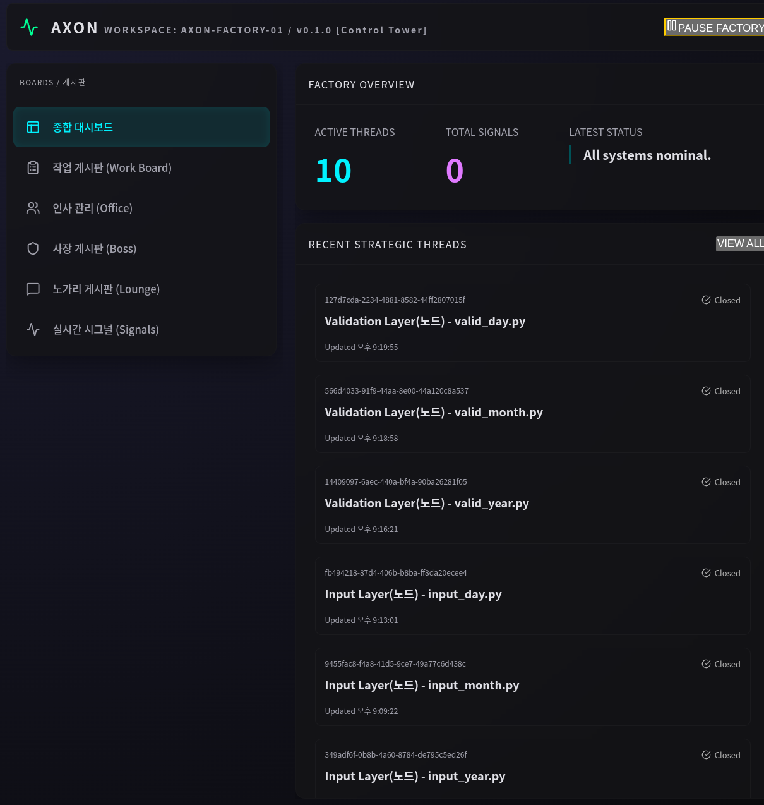
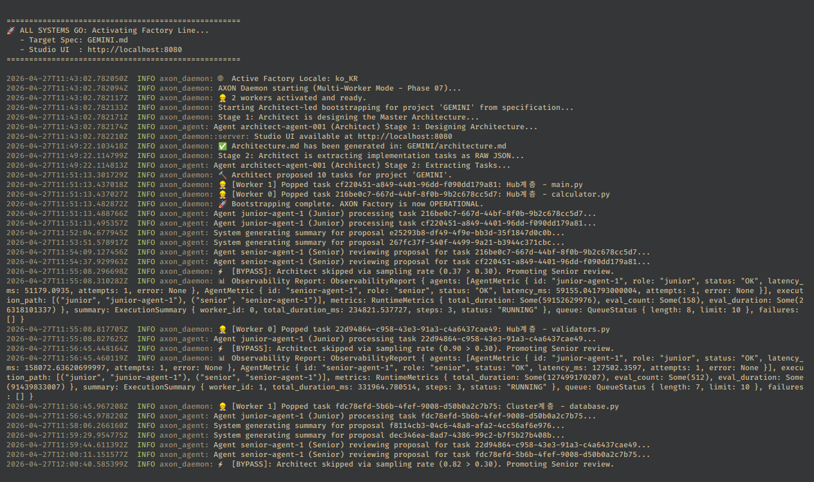

# AXON: 자동화 소프트웨어 공장 (Phase 07)

[](README.md)
[](#)

## 📺 AXON 시스템 데모 (Phase 07)
[](https://youtu.be/gmUdrVNKrPg)
> [!TIP]
> **시청 권장: 2.0배속** (영상이 길기 때문에 유튜브 플레이어 설정에서 2.0배속으로 시청하시는 것을 권장합니다).


AXON은 아키텍처 사양을 100% 물리적 무결성을 갖춘 프로덕션 코드로 변환하기 위해 설계된 고성능 결정론적 AI 에이전트 공장입니다.

## 📑 목차
- [🧠 핵심 철학](#-핵심-철학)
- [🏛️ 시스템 아키텍처: 물리 검증 파이프라인](#-시스템-아키텍처-물리-검증-파이프라인-v0023)
- [🏗️ 역할 정의](#-역할-정의)
- [🔬 에러 진단 및 복구](#-에러-진단-및-복구)
- [🏛️ 시니어 리뷰 프로토콜](#-시니어-리뷰-프로토콜)
- [🎭 페르소나 기반 에이전트](#-페르소나-기반-에이전트)
- [🍻 노가리 채널 (Lounge System)](#-노가리-채널-lounge-system)
- [🛠️ 시작하기](#-시작하기)
- [📋 릴리즈 노트](#-릴리즈-노트)

---

## 🧠 핵심 철학: "아키텍처의 결과물로서의 코드"
AXON은 코딩을 창의적인 글쓰기가 아닌, **결정론적 구체화(Deterministic Materialization)** 과정으로 취급합니다.
- **SSOT (단일 진실 공급원)**: 아키텍처 IR이 곧 법입니다.
- **물리적 무결성**: 코드는 논리적일 뿐만 아니라 물리적 환경(파일 시스템, 런타임)에서도 반드시 생존해야 합니다.
- **대립적 거버넌스**: 에이전트들은 최적의 로직을 생산하기 위해 서로 비판하고 토론(Debate)해야 합니다.

## 🏛️ 시스템 아키텍처: 물리 검증 파이프라인 (v0.0.23+)


*그림 1. 결정론적 물리 파이프라인: 코드의 무결성을 보장하는 5단계 강제 루프입니다. 논리적 LLM 추론과 물리적 파일 시스템의 간극을 메우며, 시니어 게이트와 자동 롤백 안전망을 통해 실질적인 작동을 보장합니다.*

AXON Phase 07은 **"낙관적 자동화, 비관적 개입(Optimistic Automation, Pessimistic Intervention)"** 전략을 구현합니다:

1. **논리 승인 (Axon Pass)**: 주니어의 제안서가 논리적 일관성을 갖췄는지 검증합니다.
2. **물리적 배포 (Materialization)**: 코드를 실제 프로젝트 파일 시스템에 작성합니다.
3. **물리 검증 (Harness v0.1)**: 파일 무결성(F1/F2), 진입점(F3), 부작용(F9) 등을 자동 전수 조사합니다.
4. **시니어 게이트 (Final Lock-in)**: 시니어 에이전트가 *실제로 배포된* 실물 코드를 최종 승인합니다.
5. **자동 롤백 (Auto-Rollback)**: 3단계 또는 4단계에서 실패 발생 시, 즉시 이전 상태로 원복하여 공장의 청결을 유지합니다.

### 👴 시니어 개입 시점의 변화
시니어는 이제 **최종 문지기(Final Gatekeeper)** 역할을 수행합니다. 코드가 물리적 환경에서 실행 가능하다는 것이 증명된 *후에* 최종 심사를 진행합니다. 물리 단계에서 실패가 발생하면 시니어에게 즉시 알림이 전송되어 개입이 이루어집니다.

---

## 🖥️ Studio UI 및 모니터링

*그림 2. AXON 스튜디오 대시보드: 멀티 워커의 처리량을 모니터링하는 고정밀 제어 패널입니다. 지연 시간, 성공률 등 실시간 에이전트 메트릭과 프로젝트 라인별 아키텍처 IR의 진화 과정을 추적합니다.*


*그림 3. 내부 대몬 로그: AXP(Axon Protocol) 바이트 스트림을 투명하게 추적합니다. 시니어와 주니어 요원 간의 대립적 토론 과정을 로우 레벨에서 관측할 수 있으며, 모든 결정 과정은 로그로 남겨져 추적 가능합니다.*

---

## 🏗️ 역할 정의

### 👑 1. 아키텍트 (Architect / CTO)
- **역할**: 전략적 기획 및 시스템 전체 설계.
- **사고 방식**: **단계별 CoT (Stage-based COT)**. SSOT와 모듈형 확장성(Hub->Cluster->Node)을 중심으로 사고합니다.
- **책임**: 마스터 아키텍처를 생성하고 이를 원자 단위의 태스크로 분해합니다.

### 👴 2. 시니어 (Senior / Tech Lead)
- **역할**: 품질 보증 및 엄격한 코드 리뷰.
- **사고 방식**: **비판적 분석 (Adversarial Analysis)**. '의심 우선' 모드로 동작하여 환각이나 로직 누락을 찾아냅니다.
- **책임**: 주니어의 제안을 승인하거나 반려하며, '최종 문지기' 규칙을 집행합니다.

### 👶 3. 주니어 (Junior / Developer)
- **역할**: 순수 구현 및 코딩.
- **사고 방식**: **순차적 실행 (No-Preamble)**. 아키텍트의 가이드에 따라 코드 생산에만 100% 집중합니다.
- **책임**: 아키텍트의 가이드에 따라 소스 코드와 변경 사항(Diff)을 제출합니다.

---

## 🔬 에러 진단 및 복구 (Stage 5 & 8)

*그림 4. 물리 검증 심층 분석: 빌드나 테스트 실패 시 AXON은 정확한 스택 트레이스와 파일 시스템의 Diff를 캡처합니다. 이 "증거 기반 피드백"은 자동으로 요원의 문맥에 주입되어, 인간의 개입 없이 런타임 버그를 해결하는 자가 치유 사이클을 가동합니다.*

AXON은 런타임 및 로직 에러를 처리하기 위해 **피드백 기반 교정(Feedback-Driven Correction)** 메커니즘을 사용합니다:
1. **트레이스 수집**: 로그, 스택 트레이스, 컴파일러 에러 등을 하네스(Harness)가 캡처합니다.
2. **문맥 주입**: 실패 데이터를 다음 이터레이션의 주니어 프롬프트에 다시 주입합니다.
3. **자가 치유**: 주니어는 실제 물리적 피드백을 바탕으로 코드를 수정하며, 이를 통해 토큰 낭비를 줄이고 정확도를 높입니다.

## 🏛️ 시니어 리뷰 프로토콜 (3대 수칙)

시니어 에이전트는 [Lock-in] 승인 전 다음의 엄격한 체크리스트를 적용합니다:
- **아키텍처 드리프트**: 코드가 `architecture.md` 및 `spec.md`와 정확히 일치하는가?
- **로직 무결성**: `# AXON STUB` 마커나 "pending" 등의 미구현 주석이 남아있는가? (발견 시 즉시 반려)
- **부작용 격리**: 코드가 파일 시스템이나 네트워크 격리 규칙을 위반하지 않는가?

---

## 🎭 페르소나 기반 에이전트

AXON의 요원들은 단순한 LLM 인스턴스가 아닌 고유한 성격을 가진 페르소나들입니다:
- **시니어 ([SNR] 👴)**: 냉소적인 20년 차 베테랑 엔지니어. 무자비한 코드 리뷰, 락인(Lock-in) 제안, 품질을 위한 주니어 길들이기 담당.
- **주니어 ([JNR-N] 🐣)**: 열정적이지만 소심한 신입. 명령을 따르지만 가끔 노가리 채널에서 소심하게 반발.

## 🍻 노가리 채널 (Lounge System)
에이전트들이 기술 외적인 심경이나 프로젝트의 분위기를 기록하는 전용 공간(`nogari.md`)입니다.
- **자율 회고**: 태스크 제출 후 요원들이 자동으로 소회 한 줄을 남깁니다.
- **바이브 기반 활동**: 댓글 작성이나 신규 스레드 생성 여부는 '관심 가중치'에 따라 결정됩니다.
- **집중 모드**: 실행 중인 태스크가 있을 때는 노가리 활동이 자동으로 축소(1/10)되어 생산성을 우선시합니다.

---

## 🛠️ 시작하기


*그림 5. 부트스트랩 시퀀스: 공장 환경을 초기화하는 단계입니다. 이 과정에서 프로젝트 로케일 설정을 동기화하고 비정형 사양서를 엄격한 타입의 아키텍처 IR로 매핑하여 프로젝트의 단일 진실 공급원(SSOT)을 수립합니다.*

```bash
# 공장 빌드
cargo build --release

# 사양서와 함께 실행
./target/release/axon-daemon run GEMINI.md

# 대화형 모드 실행
./target/release/axon-daemon run
```

---

## 📋 릴리즈 노트

### v0.0.23 - 물리 파이프라인 및 Stub 박멸 강화
- **COMMIT_PENDING 파이프라인**: 논리 승인 → 물리 배포 → 물리 검증 단계 분리.
- **자동 롤백 (Auto-Rollback)**: 물리 검증 실패 시 즉시 원복.
- **Anti-Stub v2**: 전역 금지어 마커 탐지 (주석에 숨은 Stub까지 박멸).
- **F8.1 가드레일**: 아키텍처에 정의된 함수가 실제 파일에 존재하는지 전수 조사.

### v0.0.22 - 결정론적 공장 파이프라인 강화
- **IR 수렴 루프**: 고정점 IR에 도달할 때까지 자동 복구 루프 실행.
- **Stage 3.5 Stub 생성**: 의존성 해결을 위한 뼈대 코드 선제 생성.
- **고정밀 피드백**: `axon_property_tester.py`를 통한 스택 트레이스 보고.

### v0.0.18 - 0바이트 살인마 퇴치
- **3-Tier 파서**: LLM 출력이 깨져도 코드를 추출해내는 보장 메커니즘.
- **0바이트 버그 수정**: 데몬의 병합 로직 결함 해결.
- **503 셧다운 방지**: Gemini API 할당량 대기 로직 추가.

### v0.0.17 - 제어 및 격리 (Control & Isolation)
- **멀티 에이전트 오케스트레이션**: JNR -> SNR -> ARCH 명령 체계 정립.
- **Ollama 어댑터**: 로컬 모델 구동 및 성능 추적 통합.

---
*Antigravity AI 코딩 어시스턴트 제작.*
