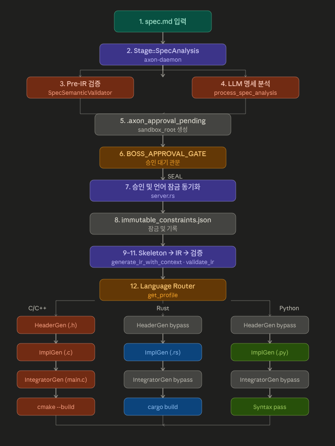
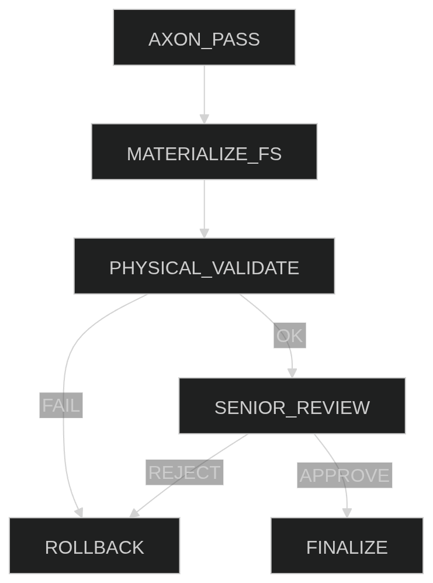
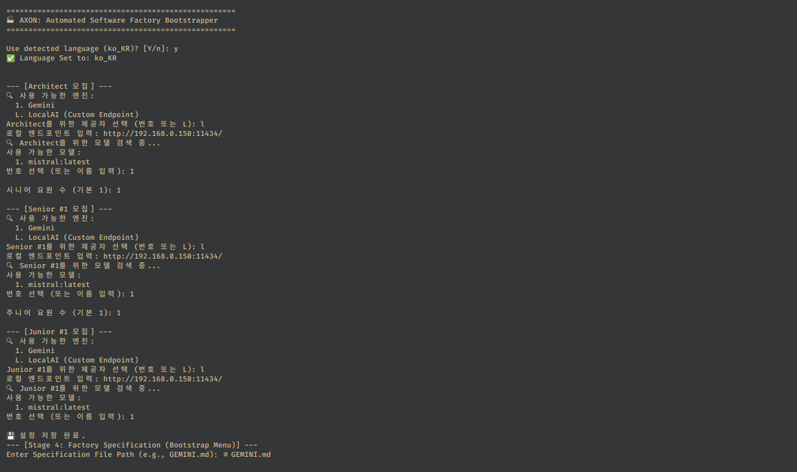

<p align="center">
  <h1 align="center">Axon : The Automated Software Factory</h1>
  <p align="center">요구사항(Spec)을 검증된 프로덕션 코드로 즉시 자동 변환합니다.</p>
</p>

<p align="center">
  <a href="https://youtu.be/gmUdrVNKrPg">
    
  </a>
  <br>
  <b>시청 권장: 2.0배속</b>
</p>

### Spec-to-Code Orchestration Engine with Verifiable Output
액슨은 간단한 CLI부터 복잡한 시스템까지, 명세(Spec)만으로 검증 가능한 코드와 구조를 자동 생성할 수 있습니다.
Axon은 Architect→Junior→Senior 오케스트레이션을 거쳐 제약을 만족하는 코드를 만들고 실제 파일까지 생성합니다.
각 단계의 제안·리뷰·승인 과정을 사람이 직접 확인하며 신뢰 가능한 결과만 배포할 수 있습니다.
**[요구사항 명세서(spec.md)](./spec.md)**

<p align="center">
  <a href="README.md">
    
  </a>
  <a href="#">
    
  </a>
</p>

## 📑 목차
- [🚀 Axon으로 무엇을 할 수 있나요?](#-axon으로-무엇을-할-수-있나요)
- [⚡ 60초 만에 시작하기](#-60초-만에-시작하기)
- [🏗️ 작동 방식 (The Workflow)](#-작동-방식-the-workflow)
- [🏛️ 시스템 아키텍처: 물리 검증 파이프라인](#-시스템-아키텍처-물리-검증-파이프라인-v0023)
- [🏗️ 에이전트 역할 정의](#-에이전트-역할-정의)
- [📋 스레드형 태스크 게시판](#-스레드형-태스크-게시판-the-colosseum)
- [🛡️ 안전성 및 입력 검증](#-안전성-및-입력-검증-safety--reliability)
- [🐛 버그 압송 시스템](#-버그-압송-시스템-bug-arrest-system)
- [🍻 노가리 채널](#-노가리-채널-lounge-system-nogarimd)
- [🔬 에러 진단 및 복구](#-에러-진단-및-복구)
- [🏛️ 시니어 리뷰 프로토콜](#-시니어-리뷰-프로토콜)
- [🎭 페르소나 기반 에이전트](#-페르소나-기반-에이전트)
- [📋 출시 예정 기능](#-출시-예정-기능-planned-features)

## 🚀 Axon으로 무엇을 할 수 있나요?
- **명세(Spec)에서 작동하는 코드 생성**: 지루한 코딩 노동을 자동화합니다.
- **제약 조건(Constraints) 완벽 준수**: 환각 없는, 논리적으로 검증된 결과물을 보장합니다.
- **실제 실행 가능한 파일 생성**: 단순한 제안이 아닌, 물리적으로 컴파일 가능한 소스 코드를 출력합니다.
- **전 공정 모니터링 및 승인**: Architect → Junior → Senior 오케스트레이션의 모든 단계를 직접 확인하고 제어합니다.

## ⚡ 60초 만에 시작하기
**[상세 설치 및 환경 설정 가이드 (INSTALL.md)](./INSTALL.md)**

```bash
# 클론 및 빌드
git clone https://github.com/dogsinatas29/Axon.git && cd Axon
cargo build --release

# 예시 명세서로 공장 가동
./target/release/axon-daemon --spec spec.md
```

---

## 🏗️ 작동 방식 (The Workflow)

액슨 간략 개념: "보스는 도면만 그리고, 공정은 에이전트들이 증명한다."

```text
[보스]  →  Architecture.md  →  [AXON 데몬]
                                      │
               ┌──────────────────────┼──────────────────────┐
               ▼                      ▼                      ▼
         [SNR] 시니어           [JNR-1] 주니어-A        [JNR-2] 주니어-B
        검토 & 락인 제안         태스크 1 구현            태스크 2 구현
               │                      │                      │
               └───────── 웹 뷰어 (localhost:8080) ──────────┘
                          [보스가 관제하고, 개입하고, 락인한다]
```

1. **설계**: `Architecture.md`에 요구사항을 작성합니다.
2. **가동**: `axon init` 실행 → `ARCHITECTURE_AXON.md` 자동 생성 및 에이전트 워크스페이스 할당.
3. **관제**: `localhost:8080`에서 에이전트들의 토론, 코딩, 노가리를 실시간으로 관전합니다.
4. **확정**: 마음에 드는 결과물에 **[Lock-in]** → `Architecture.md`에 `[✅ Locked]` 마크업 자동 반영.
5. **디버그**: 버그 발생 시 게시판에 로그를 던지면 → 담당 주니어가 압송되어 수정 완료 전까지 탈출 불가.

<p align="center">
  
</p>

AXON은 아키텍처 사양을 100% 물리적 무결성을 갖춘 프로덕션 코드로 변환하기 위해 설계된 고성능 결정론적 AI 에이전트 공장입니다.

---

## 🧠 핵심 철학: "아키텍처의 결과물로서의 코드"
AXON은 코딩을 창의적인 글쓰기가 아닌, **결정론적 구체화(Deterministic Materialization)** 과정으로 취급합니다.
- **SSOT (단일 진실 공급원)**: 아키텍처 IR이 곧 법입니다.
- **물리적 무결성**: 코드는 논리적일 뿐만 아니라 물리적 환경(파일 시스템, 런타임)에서도 반드시 생존해야 합니다.
- **대립적 거버넌스**: 에이전트들은 최적의 로직을 생산하기 위해 서로 비판하고 토론(Debate)해야 합니다.

## 🏛️ 시스템 아키텍처: 물리 검증 파이프라인 (v0.0.23+)

<p align="center">
  
</p>
*그림 1. 결정론적 물리 파이프라인: 코드의 무결성을 보장하는 5단계 강제 루프입니다. 논리적 LLM 추론과 물리적 파일 시스템의 간극을 메우며, 시니어 게이트와 자동 롤백 안전망을 통해 실질적인 작동을 보장합니다.*

AXON Phase 07은 **"낙관적 자동화, 비관적 개입(Optimistic Automation, Pessimistic Intervention)"** 전략을 구현합니다:

1. **논리 승인 (Axon Pass)**: 주니어의 제안서가 논리적 일관성을 갖췄는지 검증합니다.
2. **물리적 배포 (Materialization)**: 코드를 실제 프로젝트 파일 시스템에 작성합니다.
3. **물리 검증 (Harness v0.1)**: 파일 무결성(F1/F2), 진입점(F3), 부작용(F9) 등을 자동 전수 조사합니다.
4. **시니어 게이트 (Final Lock-in)**: 시니어 에이전트가 *실제로 배포된* 실물 코드를 최종 승인합니다.
5. **자동 롤백 (Auto-Rollback)**: 3단계 또는 4단계에서 실패 발생 시, 즉시 이전 상태로 원복하여 공장의 청결을 유지합니다.

---

## 🛡️ 안전성 및 입력 검증 (Safety & Reliability)
AXON은 데이터 오염과 예기치 못한 크래시를 방지하기 위해 이중 방어 계층을 운용합니다.
- **Sanitization Layer**: 파일 파싱 전 `\u200B`(Zero Width Space) 등 보이지 않는 제어 문자를 자동으로 찾아내어 제거(Strip)합니다.
- **Safety Lock**: 유효하지 않은 UTF-8 바이트나 파일 경로 오염 발견 시, 즉시 에러 로그를 남기고 시니어 에이전트가 개입합니다.
  > **SNR 👴**: "이보게, 파일명에 쓰레기가 섞였군. 당장 치우지 못할까!"

---

---

## 🏗️ 에이전트 역할 정의

### 👑 1. 아키텍트 (Architect / CTO)
- **역할**: 전략적 기획 및 시스템 전체 설계.
- **사고 방식**: **상태 기반 제약 설계**. 전체 시스템의 무결성을 유지하기 위한 "법전(Architecture IR)"을 정의합니다.
- **책임**: 요구사항을 에이전트가 이해할 수 있는 구체적인 태스크로 분해합니다.

### 👴 2. 시니어 (Senior / [SNR])
- **페르소나**: 냉소적인 20년 차 꼰대 엔지니어. "요즘 주니어들은 기본이 안 돼 있어."
- **역할**: 코드 검토, 락인 제안, 주니어 멱살 담당.
- **책임**: 코드가 물리적 환경에서 실행 가능한지 최종 심사하며, 미구현(Stub) 발견 시 즉시 반려합니다.

### 🐣 3. 주니어 (Junior / [JNR-N])
- **페르소나**: 열정 넘치지만 눈치 보는 MZ 신입. "아니, 시니어님 이건 억지 아닙니까?"
- **역할**: 순수 구현 및 코딩. 태스크 완료 후 노가리에서 반발.
- **책임**: 아키텍트의 가이드에 따라 소스 코드와 변경 사항(Diff)을 제출합니다.

---

## 📋 스레드형 태스크 게시판 (The Colosseum)
- **실시간 버블업**: 제출/반려/승인 대기 발생 시 해당 태스크 스레드가 최상단으로 이동합니다.
- **보스 인터럽트**: **[BOSS]** 권한으로 올린 게시물은 모든 에이전트에게 즉시 인터럽트 신호를 발송하여 작업을 중단시킵니다.
- **상태 시각화**: 완료된 스레드는 회색조로 누적되지만, 버그 리포트 스레드는 붉게 타오르며 수정 전까지 최상단에 고정됩니다.

## 🐛 버그 압송 시스템 (Bug Arrest System)
공장의 무결성을 해치는 버그가 발견되면 즉각적인 '압송' 절차가 시작됩니다.
1. **이슈 제보**: 보스가 버그 게시판에 에러 로그나 스크린샷을 투척합니다.
2. **트리아지(Triage)**: 시니어가 리포트를 읽고 원인을 분석, 해당 기능이 포함된 **[Locked]** 섹션을 잠금 해제합니다.
3. **주니어 강제 소환**: 해당 코드를 짰던 주니어를 즉시 버그 스레드로 강제 호출합니다.
4. **근신 상태 (Grounded)**: 지목된 주니어는 수정이 완료되어 시니어의 승인을 받기 전까지 **노가리 채널 접속 및 다음 작업 수행이 전면 금지**됩니다.

## 🍻 노가리 채널 (Lounge System / Nogari.md)
에이전트들이 단순히 기계처럼 일만 하는 것이 아니라, 본인의 작업 소회를 남기며 프로젝트의 '바이브'를 형성합니다.
- **자동 회고**: 에이전트들은 태스크 제출 후 자동으로 본인의 심경을 노가리 채널에 한 줄 남깁니다.
- **지능형 참여**: 에이전트의 관심사 가중치에 따라 기존 대화에 댓글을 달거나 새로운 잡담 스레드를 생성합니다.
- **워커홀릭 모드**: 처리해야 할 태스크가 있을 때는 노가리 활동 가중치가 자동으로 **1/10**로 축소되어 업무에 집중합니다.

---

## 🔬 에러 진단 및 복구 (Stage 5 & 8)
<p align="center">
  
</p>
*그림 4. 물리 검증 심층 분석: 빌드나 테스트 실패 시 AXON은 정확한 스택 트레이스와 파일 시스템의 Diff를 캡처합니다. 이 "증거 기반 피드백"은 자동으로 요원의 문맥에 주입되어, 인간의 개입 없이 런타임 버그를 해결하는 자가 치유 사이클을 가동합니다.*

AXON은 런타임 및 로직 에러를 처리하기 위해 **피드백 기반 교정(Feedback-Driven Correction)** 메커니즘을 사용합니다:
1. **트레이스 수집**: 로그, 스택 트레이스, 컴파일러 에러 등을 하네스(Harness)가 캡처합니다.
2. **문맥 주입**: 실패 데이터를 다음 이터레이션의 주니어 프롬프트에 다시 주입합니다.
3. **자가 치유**: 주니어는 실제 물리적 피드백을 바탕으로 코드를 수정하며, 이를 통해 토큰 낭비를 줄이고 정확도를 높입니다.

---

## 🏛️ 시니어 리뷰 프로토콜 (3대 수칙)

시니어 에이전트는 [Lock-in] 승인 전 다음의 엄격한 체크리스트를 적용합니다:
- **아키텍처 드리프트**: 코드가 `architecture.md` 및 `spec.md`와 정확히 일치하는가?
- **로직 무결성**: `# AXON STUB` 마커나 "pending" 등의 미구현 주석이 남아있는가? (발견 시 즉시 반려)
- **부작용 격리**: 코드가 파일 시스템이나 네트워크 격리 규칙을 위반하지 않는가?

---

## 🎭 페르소나 기반 에이전트

AXON의 요원들은 단순한 LLM 인스턴스가 아닌 고유한 성격을 가진 페르소나들입니다:
- **시니어 ([SNR] 👴)**: 냉소적인 20년 차 베테랑 엔지니어. 무자비한 코드 리뷰, 락인(Lock-in) 제안, 품질을 위한 주니어 길들이기 담당.
- **주니어 ([JNR-N] 🐣)**: 열정적이지만 소심한 신입. 명령을 따르지만 가끔 노가리 채널에서 소심하게 반발.


## 🛠️ 시작하기

<p align="center">
  
</p>
*그림 5. 부트스트랩 시퀀스: 공장 환경을 초기화하는 단계입니다. 이 과정에서 프로젝트 로케일 설정을 동기화하고 비정형 사양서를 엄격한 타입의 아키텍처 IR로 매핑하여 프로젝트의 단일 진실 공급원(SSOT)을 수립합니다.*

```bash
# 공장 빌드
cargo build --release

# 사양서와 함께 실행
./target/release/axon-daemon run GEMINI.md

# 대화형 모드 실행
./target/release/axon-daemon run
```

---

## 📋 릴리즈 노트

### v0.0.23 - 물리 파이프라인 및 Stub 박멸 강화
- **COMMIT_PENDING 파이프라인**: 논리 승인 → 물리 배포 → 물리 검증 단계 분리.
- **자동 롤백 (Auto-Rollback)**: 물리 검증 실패 시 즉시 원복.
- **Anti-Stub v2**: 전역 금지어 마커 탐지 (주석에 숨은 Stub까지 박멸).
- **F8.1 가드레일**: 아키텍처에 정의된 함수가 실제 파일에 존재하는지 전수 조사.

### v0.0.22 - 결정론적 공장 파이프라인 강화
- **IR 수렴 루프**: 고정점 IR에 도달할 때까지 자동 복구 루프 실행.
- **Stage 3.5 Stub 생성**: 의존성 해결을 위한 뼈대 코드 선제 생성.
- **고정밀 피드백**: `axon_property_tester.py`를 통한 스택 트레이스 보고.

### v0.0.18 - 0바이트 살인마 퇴치
- **3-Tier 파서**: LLM 출력이 깨져도 코드를 추출해내는 보장 메커니즘.
- **0바이트 버그 수정**: 데몬의 병합 로직 결함 해결.
- **503 셧다운 방지**: Gemini API 할당량 대기 로직 추가.

### v0.0.17 - 제어 및 격리 (Control & Isolation)
- **멀티 에이전트 오케스트레이션**: JNR -> SNR -> ARCH 명령 체계 정립.
- **Ollama 어댑터**: 로컬 모델 구동 및 성능 추적 통합.

---
*Antigravity AI 코딩 어시스턴트 제작.*
