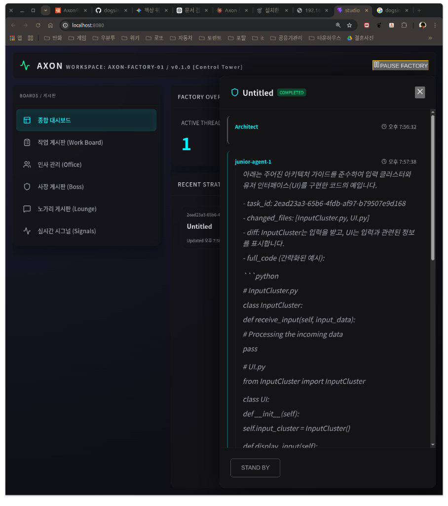
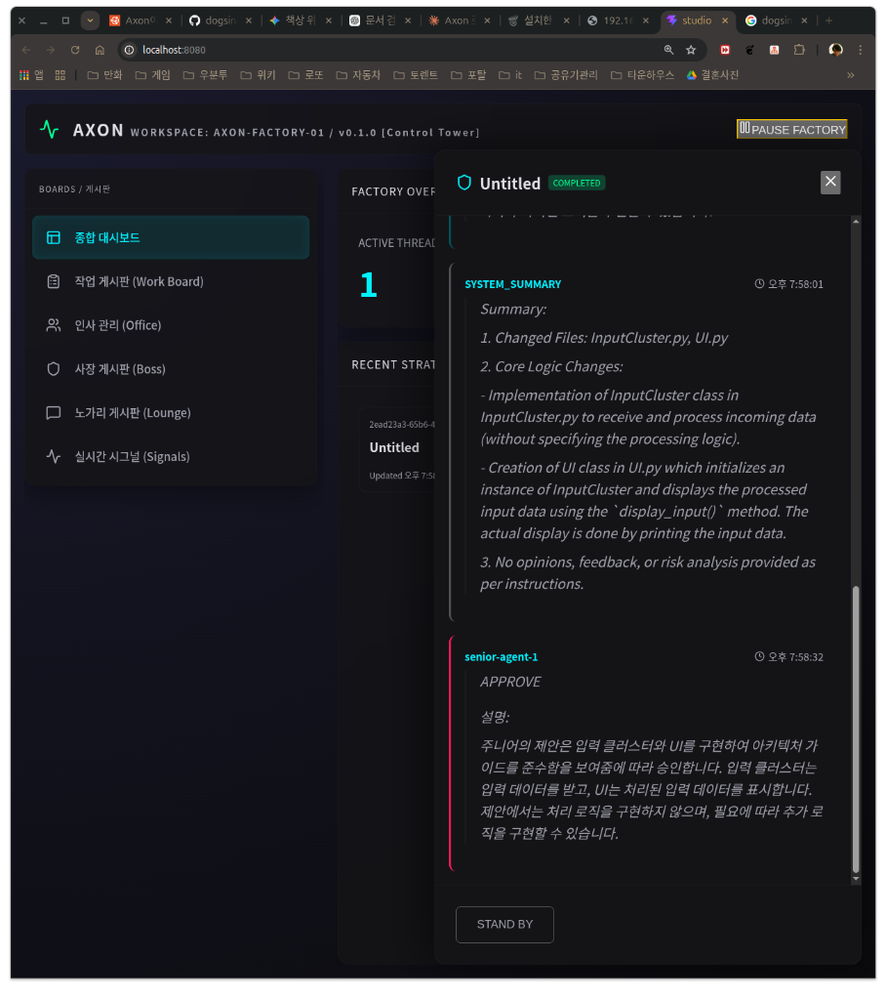

# AXON: The Automated Software Factory (Phase 07)
[한국어 버전 (Korean)](README.ko.md)


AXON is a high-performance, multi-agent AI coding factory designed to transform specifications into production-ready code with minimal human intervention. Phase 07 focuses on **Localization**, **Robust Isolation**, and **Inference Optimization**.

## 🖼️ Visual Overview

| 1. Factory Setup | 2. Daemon Execution |
|---|---|
|  |  |
| *Recruiting agents and configuring local models.* | *Real-time task distribution and metric collection.* |

| 3. Studio Dashboard | 4. Task Details |
|---|---|
|  |  |
| *Monitoring the entire production line via Control Tower.* | *Inspecting individual thread status and agent proposals.* |

## 🚀 Key Features & Updates

### 1. Total Terminal Localization
- Added **Multi-Language Support** (English, Korean, Japanese).
- All CLI prompts, recruitment messages, and system logs are dynamically localized based on user preference.
- Persistent language settings in `axon_config.json`.

### 2. Intelligent Code Extraction Engine
- **Language-Agnostic**: Automatically detects and extracts code blocks (Python, JS, Rust, etc.) from agent proposals.
- **Filename Auto-Detection**: Scans comments (e.g., `# main.py` or `// server.js`) to restore the original file structure.
- **Isolation Sandbox**: Automatically creates project-specific directories (e.g., `./GEMINI/src/`) for clean workspace management.

### 3. Architect CTO Intelligence
- **Strategic Decomposition**: Upgraded Architect persona to a **CTO level**, forcing it to break down large specs into atomic, parallelizable tasks.
- **Inference Optimization**: Streamlined system prompts for local LLMs (Ollama/Mistral) to reduce latency by up to 2x.

### 4. Stability & UI Synchronization
- **Fixed OS Error 36**: Resolved "File name too long" issues during bootstrap.
- **Real-time Status Sync**: Corrected thread status propagation to ensure the Studio UI correctly displays "Completed" and updates dashboard metrics.

## 🛠️ Getting Started

```bash
# Build the factory
cargo build --release

# Run with a specification (Direct)
./target/release/axon-daemon run GEMINI.md

# Run interactively
./target/release/axon-daemon run
```

---
*Created by Antigravity AI Coding Assistant.*

## 📋 Release Notes: v0.0.17 - Control & Isolation

### 🚀 Key Features
- **Multi-Agent Orchestration**: Enforces `Junior -> Senior -> Architect` chain of command with Round-Robin scheduling.
- **Ollama Runtime Adapter**: Native support for local model orchestration with performance tracking.
- **Observability & Reporting**: Real-time metric collection and event bus integration for execution paths.
- **Robust Bootstrap Protocol**: Phased initialization for configuration and context building.

### 🛠️ Technical Changes
- **Core**: Added `ObservabilityReport` and `RuntimeMetrics` to storage and agent logic.
- **Model Driver**: Updated trait to return structured metrics.
- **Daemon**: Implemented layer-based fallback and task-to-sandbox sync logic.
