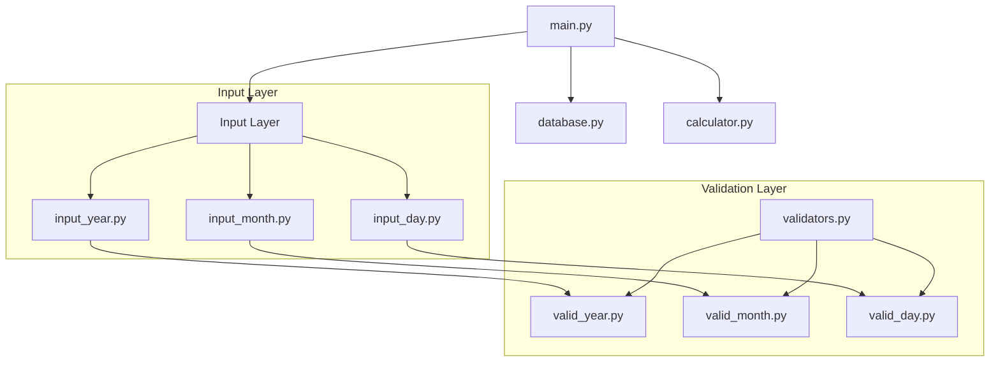

# 프로젝트: SYNAPSE 논리 검증용 나이 계산기 (v0.4-Heavy)

> [!NOTE]
> 본 문서는 SYNAPSE 시스템의 논리 검증을 위한 나이 계산기 프로젝트의 표준 규격서입니다. 
> ECS(Extreme Modularization, Common-sense logic, Smart visual) 원칙에 따라 설계되었습니다.

---

## 1. 핵심 설계 원칙 및 요구사항

### 1-1. LLM 코딩 4대 원칙 (ECS) [cite: 2026-02-14]
- **목표 중심 (Goal-Oriented)**: 외부 라이브러리를 적극 활용하여 로직의 견고함과 출력의 가독성을 극대화합니다.
- **단순성 우선 (Simplicity First)**: 복잡한 기능을 직접 구현하지 않고 검증된 라이브러리(`rich`, `dateutil`, `pandas`)를 활용합니다.

### 1-2. 필수 외부 라이브러리 (Requirements)
| 라이브러리 | 역할 | 비고 |
| :--- | :--- | :--- |
| **`rich`** | 터미널 UI 시각화 및 예외 메시지 강조 | 필수 |
| **`python-dateutil`** | 정밀 날짜 연산 및 만나이 계산 | 필수 |
| **`pandas`** | DB 데이터 처리 및 통계 가시화 | 필수/옵션 |

> [!TIP]
> 설치 명령어: `pip install rich python-dateutil pandas`

---

## 2. 시스템 아키텍처 (Extreme Modularization)

프로젝트는 로직의 완전한 격리와 독립성을 위해 각 기능을 최소 단위 파일로 분리하였습니다.

- **`main.py`**: 전체 제어부 및 메인 대시보드 출력.
- **`database.py`**: SQLite3 및 `pandas` 기반 데이터 영속성 관리.
- **`calculator.py`**: `relativedelta`를 이용한 정밀 나이 계산. [cite: 2026-01-21]
- **`validators.py`**: 검증 로직 통합 관리 및 공통 예외 처리.

---

## 3. 데이터 모델 (SQLite3)

**Table Name**: `user_records`

| Field | Type | Attributes | Description |
| :--- | :--- | :--- | :--- |
| `id` | INTEGER | PRIMARY KEY AUTOINCREMENT | 시스템 고유 ID |
| `name` | TEXT | UNIQUE | 사용자 이름 (식별자) |
| `birth_year` | INTEGER | - | 출생 연도 |
| `birth_month` | INTEGER | - | 출생 월 |
| `birth_day` | INTEGER | - | 출생 일 |
| `created_at` | TIMESTAMP | DEFAULT CURRENT_TIMESTAMP | 기록 생성 시간 |

---

## 4. 로직 설계 (ECS Workflow) [cite: 2026-01-21]

### Step 1: 이름 입력 및 DB 페어링 (Bypass Logic)
- 이름 입력 시 즉시 DB 조회.
- 기존 기록 존재 시 `rich.panel`로 정보 표시 후 사용자 승인 시 입력 단계 전체를 **Bypass** 하여 계산 단계로 직행합니다.

### Step 2: 단계별 방어적 입력 (Validation Loop)
- **Birth Year**: 현재 연도(2026) 이하 검증. 120세 이상 차이 발생 시 재확인 분기 실행. [cite: 2026-02-19]
- **Birth Month**: 1~12 범위 검증.
- **Birth Day**: 윤달 및 월별 말일 보정 로직 적용 (Leap Year support).

### Step 3: 나이 계산 및 동기화
- **한국 나이** vs **만 나이** 선택 분기 처리.
- 최종 결과를 출력하고 신규/수정 데이터를 DB에 반영합니다.

---

## 5. 시각화 및 검증 목표 [cite: 2026-02-11]

- **Loop Visualization**: 입력 단계의 실패 및 재시도 루프가 시각적으로 명확히 표현되어야 합니다.
- **Bypass Edge**: DB 매칭 시의 "건너뛰기" 흐름이 아키텍처 상으로 올바르게 연결되어야 합니다.
- **External Node**: 외부 라이브러리(`rich`, `dateutil`, `pandas`)와의 의존성 노드가 명확히 형성되는지 확인합니다.
