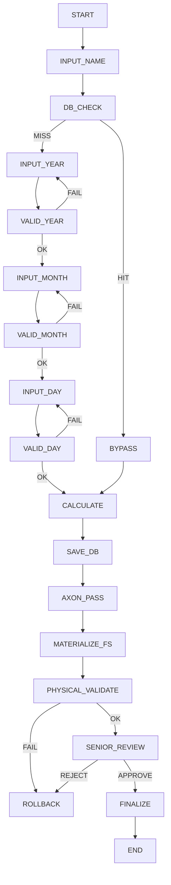

# SYNAPSE Axon IR Spec v0.5 (Full Pipeline Integrated)

## 1. Overview

This specification extends v0.4 to include full pipeline validation:

- Logical Validation (Axon)
- Materialization Layer
- Physical Validation
- Senior Gate

Goal: Ensure end-to-end correctness from IR → Real Execution.

---

## 2. Node Definitions

### Core Nodes
- START (control)
- INPUT_NAME (input)
- DB_CHECK (process)
- BYPASS (control)
- INPUT_YEAR (input)
- VALID_YEAR (validation)
- INPUT_MONTH (input)
- VALID_MONTH (validation)
- INPUT_DAY (input)
- VALID_DAY (validation)
- CALCULATE (compute)
- SAVE_DB (persistence)
- END (control)

### New Pipeline Nodes
- AXON_PASS (control)
- MATERIALIZE_FS (system)
- PHYSICAL_VALIDATE (validation)
- SENIOR_REVIEW (control)
- FINALIZE (control)
- ROLLBACK (control)

---

## 3. Full Pipeline Flow

---

## 4. Constraints

### Logical Layer
- VALID_YEAR → VALID_MONTH → VALID_DAY 순서 유지
- CALCULATE는 validation 완료 또는 bypass 데이터 필요
- BYPASS는 입력 단계 전체 skip

### Pipeline Layer
- AXON_PASS 이후에만 MATERIALIZE_FS 실행 가능
- PHYSICAL_VALIDATE는 MATERIALIZE_FS 이후 실행
- SENIOR_REVIEW는 PHYSICAL_VALIDATE 성공 시에만 진입 가능
- ROLLBACK은 언제든 실패 시 도달 가능

---

## 5. Loop Definitions

- VALID_YEAR ↔ INPUT_YEAR
- VALID_MONTH ↔ INPUT_MONTH
- VALID_DAY ↔ INPUT_DAY

---

## 6. Failure Handling

| Stage | Failure | Action |
|------|--------|--------|
| Validation | invalid input | retry loop |
| Axon | constraint violation | abort |
| Materialize | fs error | rollback |
| Physical | build/run fail | rollback |
| Senior | reject | rollback |

---

## 7. External Dependencies

- chrono → calculation
- rusqlite → DB
- ratatui → UI

---

## 8. IR Semantics

- 모든 validation은 Result 기반
- 모든 control node는 side-effect 없음
- persistence는 idempotent
- rollback은 상태 복원 보장

---

## 9. Verification Targets

- Loop integrity
- Bypass correctness
- Constraint satisfaction
- Physical execution validity
- Human gate minimality

---

## 10. Pipeline Guarantees

이 구조가 보장하는 것:

1. 논리적으로 맞다 (Axon)
2. 실제로 돌아간다 (Physical Validator)
3. 구조적으로 안전하다 (Senior Gate)

---

## 11. Expected Axon Properties

- ≥3 validation loops
- ≥1 bypass edge
- ≥1 rollback path
- strict stage ordering
- no direct skip from INPUT to FINALIZE

---

## 12. Summary

v0.5는 단순 IR이 아니라:

"Logic → Reality → Human Sanity Check"

를 하나의 그래프로 통합한 검증 시스템이다.
